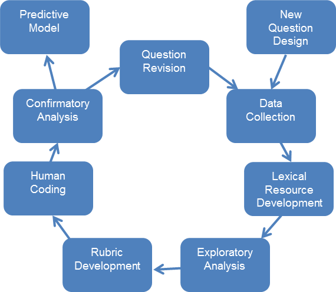
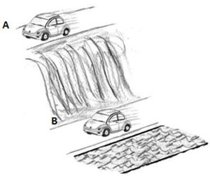
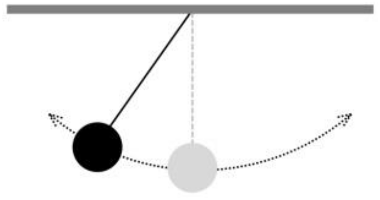
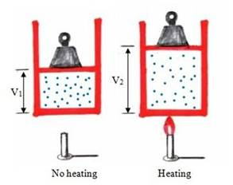

## Automated Analysis of Constructed Response (AACR)

__Student ideas__   
* Contain pre-conceptions about complex processes in science
* Often heterogeneous or “mixed-models”
* May be identified by students’ use of language

__Constructed Response questions__   
* Provide richer insight into student ideas than multiple-choice
* Are time-consuming to evaluate in large classes

--- 

## Automated Analysis of Constructed Response (AACR)

__Objectives__   
* Evaluate students’ understanding of scientific concepts
* Facilitate using authentic writing tasks in large STEM courses
* Use linguistic and statistical analysis to analyze students’ writing
* Validate by predicting expert ratings

__The AACR Research Group__
* 7 Institutions (Colorado-Boulder, Georgia, Maine, MSU, South Florida, SUNY-Stony Brook, West Michigan)
* Multidisciplinary

--- .class #id 

## The AACR Approach

  

The AACR Question Development Cycle

---

## Astronomy

 - The AACR Astronomy question collection is comprised two 3-item sets
     - Three items adapted from _The Light and Spectroscopy Concept Inventory_ (LSCI) (Bardar et al. 2007)
     - Three items adapted from _The Star Properties Concept Inventory_ (Bailey et al. 2012)
 - Adaptation involves removing multiple choice answers, slight rewording if necessary
 - _The Light and Spectroscopy Concept Inventory_ items selected for items with high post-difficulty and low post-discrimination (Schlingman et al. 2012)

---

## LSCI Question 17

  

The bright line emission spectrum shown above is characteristic of the region of the nebula marked in the  drawing.  By comparing the *positions* of the lines in the spectrum to a known laboratory spectrum on Earth, which of the following properties of the nebula can be *directly* determined?  
a. Motion towards or away from Earth only. 
b. Temperature only.  
c. Chemical composition (type of atoms) only.  
d. Motion and chemical composition.  
e. Motion, temperature, and chemical composition.

---

## AACR Adaptation 

  

The bright line emission spectrum shown above is characteristic of the region of the nebula marked in the drawing. By comparing the positions of the lines in the spectrum to a known laboratory spectrum on Earth, what properties of the nebula can be directly determined?

>*"It can be determined that the nebula emits mostly blue light
>and that it has shorter wavelengths with a higher frequency."*

>*"One could probably determine the nebula's temperature and distance
from Earth by the data found on the emission spectrum."*

---

## Energy in Mechanics

  

* Three items adapted from _the Inter-Disciplinary Energy Assessment_ (IDEA) (Park 2013)
* Used in to test the "two tier" implementation of the IDEA (Park 2015)
    - Multiple choice plus "explain your answer" follow-up

---

## Energy in Mechanics

A student is playing with a pendulum as shown below. After a while, the ball stops swinging. Why does the ball stop swinging?

  

"*every time the pendulum reaches max height gravity will act on it and lower energy.eventually stopping the pendulum*"

---

## Thermodynamics

 * Five items exploring student understanding of the energetic states of fluids
 
A variable-volume cylinder holds an ideal gas as shown below. The temperature of the gas is increased by heating. Explain the changes of the kinetic energy of the gas atoms without using equations.

  

*"The kinetic energy of the gas atoms will increase as a result of the increasing
of the molecular velocity. However, if the volume increases to maintain constant
pressure, the kinetic energy will stay the same because of the unchanged in the
velocity of the molecules."*

---

## References

Bailey, J. M., Johnson, B., Prather, E. E., & Slater, T. F. (2012). Development and validation of the star properties concept inventory. International Journal of Science Education, 34(14), 2257-2286.

Bardar, E. M., Prather, E. E., Brecher, K., & Slater, T. F. (2007). Development and validation of the light and spectroscopy concept inventory. Astronomy Education Review, 5(2), 103-113.

Park, M. (2013). Developing an instrument for assessing students’ understanding of the energy concept across science disciplines. Doctoral dissertation, October 22, 2013, State University of New York at Buffalo.

Park, M., Haudek, K., & Urban-Lurain, M.. (2015). Computerized lexical analysis of students’ written responses for diagnosing conceptual understanding of energy. In NARST 2015 Annual International Conference. presented at the 04/2015.

Schlingman, W. M., Prather, E. E., Wallace, C. S., Rudolph, A. L., & Brissenden, G. (2012). A classical test theory analysis of the Light and Spectroscopy Concept Inventory national study data set. Astron Educ Rev, 11, 010107.

--- &twocol 

## For More on AACR

*** =left

### Please see our posters

__Session 1: PST1E46__    
*Students Own Words: The Automated Analysis of Constructed Response Project*   

**Session 2: PST2E07**   
*AACR: Automated Analysis of Construct Response Physics and Astronomy Questions*

*** =right

### And our Web site

[http://msu.edu/~aacr](http://msu.edu/~aacr)  
[http://msu.edu/~aacr/aapt](http://msu.edu/~aacr/aapt)

